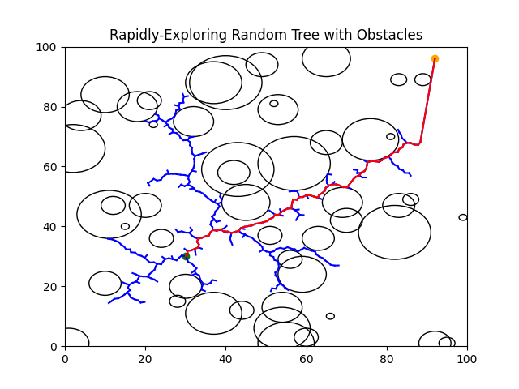
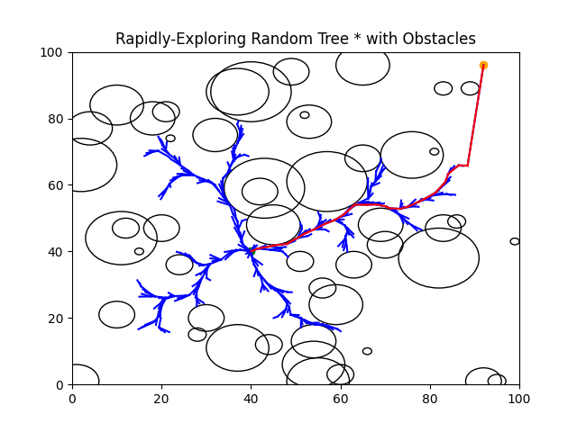

# Path_planning_algo_2D_with_obstacles
Implementation of path planning algorithms (RRT, RRT*, etc.) in a 2D environment containing obstacles.

---

## 📌 Overview

So far 2 algorithms have been developped:
- Rapidly exploring random tree **RRT**, 
- Rapidly exploring random tree star **RRT\***

## 📈 Visualize Results

 </img>

 </img>

---

## 🤝 Contributing

Contributions are welcome!

Future improvements could include:
- New path planning algo (like Linear-quadratic regulator rapidly exploring random tree)

---

## 📚 References

1. [Rapidly-Exploring Random Tree Github repo](https://github.com/r-shima/rrt)
